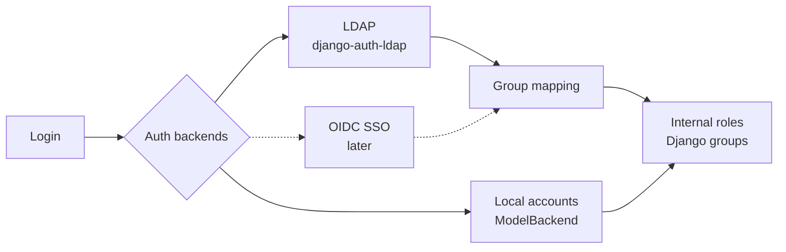
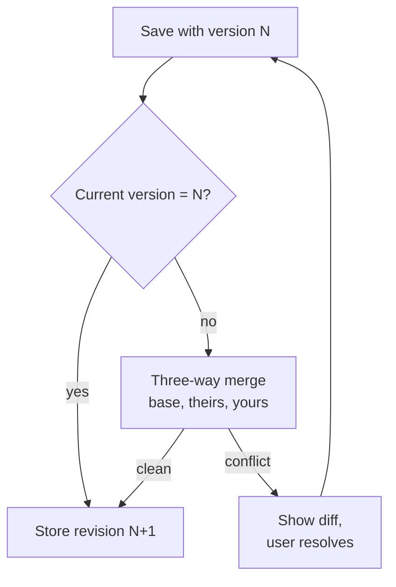
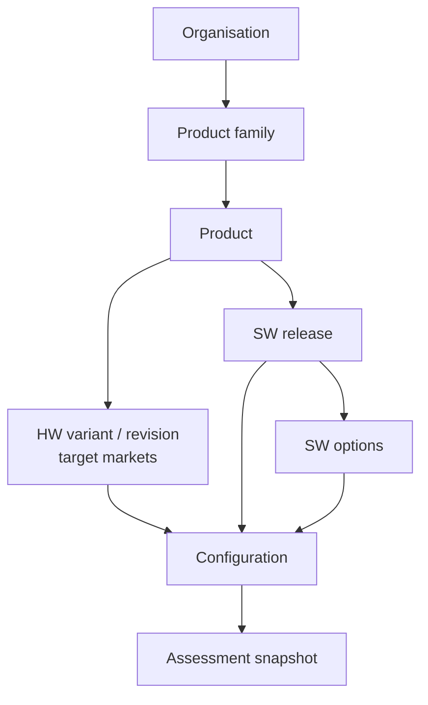
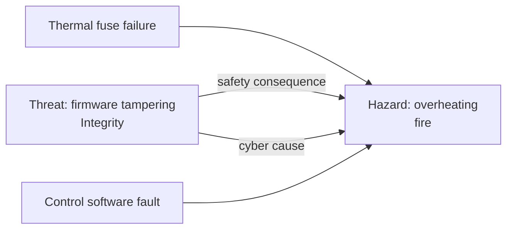

# System Architecture: Technology Baseline

Last updated: 2026-09-22

## Summary

The system is a server-rendered Django application on PostgreSQL, with HTMX for interactivity and a REST API alongside for scripting. Users are software professionals on wide screens; mobile is supported but not a design target.

| Layer | Choice | Notes |
| --- | --- | --- |
| Backend | Django (current LTS) | Custom user model from day one |
| Database | PostgreSQL in dev, CI and prod | SQLite only for throwaway experiments |
| Authentication | Local accounts + LDAP (`django-auth-ldap`) | OIDC SSO later; SAML only if required |
| UI | Django templates + HTMX + Alpine.js | No SPA, minimal or no JS build |
| Editor | CodeMirror 6, Markdown mode | Side-by-side preview |
| Markdown rendering | `markdown-it-py` or `mistune` + `nh3` sanitizing | Rendered server-side, cached per revision |
| Charts | Apache ECharts (or Chart.js) | JSON from Django views |
| API | django-ninja or DRF + `drf-spectacular` | Token auth, OpenAPI schema |
| Background jobs | `django-tasks` + `django-tasks-db` (Postgres-backed) | No Redis; see docs/adr/0007-background-job-backend.md |
| Tooling | `uv`, `ruff`, `pytest-django` | Env-var config via `django-environ` |
| Deployment | Containers, gunicorn behind a reverse proxy | nginx or existing proxy |

## Backend and database

PostgreSQL runs in every environment that matters: local development (via `docker compose`), CI and production. SQLite stays available for quick throwaway experiments only.

Why not SQLite in development: the two databases differ in ways that surface late.

- JSONField queries behave differently.
- Case sensitivity and collation differ.
- Constraint enforcement and concurrency differ.
- Full-text search, `ArrayField` and `pg_trgm` have no SQLite equivalent.

Running PostgreSQL everywhere lets the system use PostgreSQL features (notably full-text search for documents) without a second code path.

The project defines a custom user model (`AUTH_USER_MODEL`) before the first migration. Changing it later is costly, and SSO will need extra fields.

## Authentication and authorization

Users sign in with LDAP or a local account; SSO is designed for now and built later. Authorization uses internal roles, independent of where a user's identity comes from.



Every backend feeds the same internal roles, so adding SSO means adding one backend and one group mapping.

- **Local accounts:** `ModelBackend` stays enabled for admins and as a break-glass path when LDAP is down.
- **LDAP:** `django-auth-ldap`, over LDAPS or StartTLS only. LDAP groups map to internal roles in one place; code never checks LDAP group names directly.
- **Identity source:** each user records its source (`local`, `ldap`, `oidc`) to prevent collisions when the same username exists in two sources.
- **SSO (later):** OIDC first, via `mozilla-django-oidc` or `django-allauth`; it covers Entra ID, Keycloak and Okta. SAML only if a customer requires it.
- **API access:** personal API tokens for scripting, managed by each user.

## Browser interface

The UI is server-rendered Django templates with HTMX, plus Alpine.js for small client-side behavior. The system has no visual editing or hard real-time needs, so an SPA would add a second codebase and build pipeline for no gain.

Design principles for software professionals on wide screens:

- **Use the full width.** No fixed 1200 px column. Master–detail and multi-pane layouts: list left, detail right, optional context panel.
- **Dense, scannable data.** Compact tables with sorting, filtering, column selection and resizable panes.
- **Keyboard first.** Shortcuts for navigation and search; a command palette (Ctrl/Cmd+K) as the app grows.
- **Deep links for every state.** Filters, selected items and tabs live in the URL so links can be pasted into tickets and chat.
- **Dark mode from the start**, built on CSS variables.
- **Mobile: usable, not designed for.** Panes collapse into stacked views on narrow screens.

## Documents and concurrent editing

Documents are Markdown, protected against lost updates by optimistic locking, soft edit locks and full revision history. Real-time co-editing (CRDTs such as Yjs over WebSockets) is out of scope unless people routinely write in the same document at the same moment.

**Optimistic locking.** Each document has a `version` number, and the edit form carries the version it started from. A save runs `UPDATE ... WHERE id=? AND version=?`; if another save came first, it is rejected, the user's text is kept, and a merge view opens.

**Soft edit locks.** Opening the editor records a lease ("Alice is editing since 22:40"), renewed by an HTMX heartbeat every 30–60 s. Others see a warning but are not blocked; stale leases expire on their own.

**Revision history.** Every save stores a revision, giving audit, diffs and rollback.



The automatic merge uses `diff-match-patch` or `difflib`; the user sees a diff only when it fails.

Markdown handling:

- **Editor:** CodeMirror 6 in Markdown mode, preview side by side on wide screens. It remains a plain text field underneath, so HTMX forms work unchanged.
- **Rendering:** server-side with `markdown-it-py` or `mistune`. Output is always sanitized with `nh3` to prevent XSS, then cached per revision.
- **Extras:** fenced code with Pygments highlighting, tables, task lists and links between documents.
- **Search:** PostgreSQL full-text search.

## Dashboards

Dashboards refresh per widget with HTMX polling (`hx-trigger="every 60s"`); no WebSockets are needed at this level of freshness.

- **Charts:** Apache ECharts or Chart.js, fed JSON by a Django view. Both work in server-rendered pages without a framework.
- **Performance:** aggregate queries are cached with a short TTL via Django's cache framework, or precomputed by background jobs when heavy.
- **Later option:** Server-Sent Events if push updates become necessary.

## API, jobs, tooling and operations

The system is API-first: everything a user can do in the browser should be scriptable.

- **API:** django-ninja, or DRF with `drf-spectacular`, publishing an OpenAPI schema. Token authentication; a CLI can follow.
- **Background jobs:** `django-tasks` + `django-tasks-db`, Postgres-backed like everything else — no Redis. See docs/adr/0007-background-job-backend.md. LDAP sync, notifications, imports and dashboard precomputation are anticipated job types; only staleness recomputation (assessments and risk assessments) is built so far.
- **Configuration:** environment variables via `django-environ`, one settings module, no secrets in the repository.
- **Tooling:** `uv` for dependencies, `ruff` for linting and formatting, `pytest-django` for tests, CI against PostgreSQL.
- **Deployment:** containers running gunicorn (uvicorn if async is needed) behind nginx or the existing reverse proxy.
- **Audit logging:** who changed what and when, via `django-simple-history` or similar, added from the start.

## Requirement sources

Regulations and other obligations are content, not code: versioned, schema-validated packages that the application evaluates. Adding a regulation means writing a package, never changing application code.

| Source type | Binding nature | Applicability | Examples |
| --- | --- | --- | --- |
| Legislation | Legal | Rule-based from answers | CRA, RED, LVD, GDPR |
| Harmonised standard | Presumption of conformity | Linked from legislation | EN 18031, EN 62368 |
| QMS / internal procedure | Internal | Selected per organisation or family | ISO 9001 procedures |
| Customer requirement | Contractual | Selected per product or customer | Customer security specs |
| Guidance | Non-binding | Reference only | Blue Guide, RED guide, CRA FAQ |

Only legislation can create legal obligations; the schema enforces this, and the UI labels guidance as non-binding. First targets: CRA, RED, LVD and GDPR; NIS2 as customer-driven supply-chain requirements; IEC 62443 later.

A package contains:

- **Identity:** id (namespaced), version, jurisdiction, legal sources (CELEX/ELI), dates of application, supersedes/amends links.
- **Questions:** typed (boolean, choice, number with unit), each declaring its natural level (product, hardware, software, option), with optional conditions (radio band questions only if a radio is present). Questions are shared across packages.
- **Scope rules:** inclusion, exclusions and exemptions, each with a legal reference.
- **Classifications:** classes or categories that change requirements and assessment routes (CRA default / important I / important II / critical; RED 3(3)(d)(e)(f) categories).
- **Requirements:** tagged by role (manufacturer, importer, distributor), class and date.
- **Assessment routes:** internal control, type examination, notified body, and when each is allowed.
- **Finding rules:** info, caution or action-required findings raised by answer combinations.
- **Test fixtures:** example products with expected outcomes.

Rules are declarative expressions (JSONLogic or a small custom language) evaluated safely, never Python `eval`.

```yaml
source: eu-cra
type: legislation
jurisdiction: EU
version: 2024-2847@2026-09
sources: [{celex: 32024R2847}]
questions:
  - id: has_data_connection
    type: boolean
    level: software
scope:
  include: {var: has_data_connection}
  exclude:
    - id: medical_devices
      when: {var: is_medical_device}
      ref: "Art. 2(2)"
```

**Copyright:** EU legal text may be stored with attribution. Standards (EN, IEC) are stored as references, clause numbers and own summaries only; fields carry `redistributable: false` where applicable.

**Import and sanity checks.** Official packages live in version control and are reviewed by the maintainer. User packages pass four layers before use:

1. **Structural:** JSON Schema validation.
2. **Semantic linting:** referenced questions exist, expressions type-check against question types, no supersedes cycles, consistent dates, namespaced ids that cannot shadow official packages.
3. **Fixtures:** the package's own test cases must pass.
4. **Provenance:** the UI and reports show whether an assessment used an official or a local package.

Every import shows a diff against the previous version and requires approval before publishing.

## Products and assessments

An assessment covers one configuration: a hardware variant and revision, a software release and a set of selected options. Answers are layered with explicit inheritance, and approval freezes a snapshot.



Only configurations actually shipped are defined, to avoid assessing every combination.

**Target markets first.** Each hardware variant selects its target markets (e.g. EU, US). Only packages for those jurisdictions are active, so their questions alone are asked; FCC questions never appear for an EU-only variant. Adding a market later adds unanswered questions and marks approved assessments stale.

**Answer inheritance.**

1. Each question declares its natural level in the package: product (intended use), hardware (radio, supply voltage), software (network services, personal data) or option.
2. Answers resolve by precedence: option → SW release → HW variant → product. The UI shows each answer's origin ("inherited from HW rev B"); overriding requires a justification.
3. A new release copies answers forward as "needs confirmation". Reviewers may confirm in bulk, but must confirm actively.
4. Options are deltas: they override a few answers and inherit the rest, which shows exactly why an option changes scope.

**Capability vs enablement.** Features such as radios are two answers at two levels:

| Level | Question | Values |
| --- | --- | --- |
| Hardware | Capability | Not present · present · present but physically disabled |
| SW release / option | Enablement | Enabled · disabled, user-enableable · disabled, enableable only by manufacturer update |

Whether a dormant feature is in scope is an interpretation encoded in the package with a legal reference, not in application code.

**Findings.** Rules produce findings alongside scope results, at three levels: info, caution and action required. A caution is the "OK, but" case, e.g. "Wi-Fi hardware present but disabled; enabling it by update or option changes RED and CRA scope and requires re-assessment." Findings appear in reports and later feed the risk assessment (dormant capability is attack surface). An option that enables a flagged feature triggers re-assessment automatically.

**Results.** Per active source: in scope, out of scope, excluded (with reason and article), or in scope with limitations (class and assessment route).

**Snapshots.** Approval freezes the resolved answers, package versions, results and findings. Later changes to parent answers or packages never alter an approved assessment; they flag it as stale for re-review.

## Organisations and roles

The tool is an open-source team tool, single-tenant per deployment, but with organisation as the top-level scope from day one; retrofitting it later is costly. Organisations and product families also structure navigation in the master–detail layout.

**Role assignments** are records of (user or group, role, scope), inherited down the hierarchy organisation → family → product. An approver on a family approves all its products unless narrowed. LDAP groups can map directly to assignments. A custom table is preferred over a generic per-object permission library, for simpler hierarchical queries.

| Role | Can |
| --- | --- |
| Viewer | Read products, assessments and reports |
| Editor | Answer questions, create releases and configurations |
| Approver | Approve assessment snapshots |
| Content curator | Import and manage requirement sources |
| Organisation admin | Manage members, role assignments and policies |

**Separation of duties** is an organisation policy: off, warn (default) or enforce. Families and products may only tighten it, never loosen it. "Same person" means anyone who edited any answer in the snapshot, not just the last editor. An approval made despite a warning is recorded in the audit trail and shown in the report.

**Product-level authoring (deferred).** Product and everything beneath it (hardware variants/revisions, software releases/options, configurations) is Django-admin-only today; the Editor row above ("create releases and configurations") isn't yet enforced through any non-admin path. ADR 0008 records the intended fix — a dedicated authoring surface gated by role assignments, with add/modify/approve at product level and below, and delete blocked once approved. Organisation, product family, groups, requirement/method/catalog packages and user records stay admin-only by design, not as a gap.

## Risk assessment: methods and catalogs

Risk assessment is package-driven like applicability: method packages define how risk is scored, catalog packages define what is analysed. The default method is CIA-based asset analysis with a 5 × 5 severity × likelihood matrix. Each regulation selects the method(s) it requires, so one product can use several methods.

| Package kind | Defines | Examples |
| --- | --- | --- |
| Method | Security properties, severity and likelihood scales, matrix, acceptance thresholds, optional factor-based likelihood, optional severity mapping to other methods | `default-cia-5x5`, attack-potential method, safety hazard method |
| Catalog | Asset types with typical CIA needs, threats tagged with violated properties, hazards, suggested controls, triggers | Generic IoT threats, LVD hazards, CRA Annex I threat categories |

Regulation packages may contribute catalog entries and declare which method applies to which entry type, so the regulation that requires the analysis also seeds it.

```yaml
method: default-cia-5x5
properties: [confidentiality, integrity, availability]
severity:  {scale: 1-5, labels: [negligible, minor, moderate, major, critical]}
likelihood: {scale: 1-5, labels: [rare, unlikely, possible, likely, almost_certain]}
matrix:
  - {when: {">=": [{"*": [{var: s}, {var: l}]}, 15]}, level: high}
  - {when: {">=": [{"*": [{var: s}, {var: l}]}, 6]},  level: medium}
  - {level: low}
acceptance: {high: must_treat, medium: justify, low: accept}
```

**Suggestions from applicability.** Catalog entries carry triggers in the same expression language as scope rules, so answers and findings pre-populate the register:

- Wi-Fi present → wireless threats (eavesdropping, rogue access points).
- Dormant-radio caution → "unauthorised enablement of a disabled interface".
- Mains powered above 50 V AC → electric shock and fire hazards.

Suggestions are proposals: the user accepts them, or dismisses them with a reason. Custom assets, threats and hazards can always be added.

## Risk register

One register per product holds typed entries: assets, threats and hazards. Cause and consequence are kept separate: CIA says how an asset is compromised, impact categories say what happens as a result, including harm to people and property.

**Assets and threats.**

1. Each asset is rated for confidentiality, integrity and availability on the method's severity scale.
2. Each threat targets one asset and names the property it violates.
3. Each threat has one or more consequences, each in an impact category with its own severity. The threat's severity is the worst consequence; by default a consequence inherits the asset's rating for that property, and overrides need a justification.
4. Likelihood is rated per threat, or computed from factors if the method defines them. The matrix gives the risk level.

| Impact category | Example | Links to |
| --- | --- | --- |
| Safety (people) | Overheating causes burns | A hazard entry |
| Property damage | Fire damages premises or equipment | A hazard entry |
| Operational | Device or connected systems unavailable | — |
| Financial | Fraud, recall costs | — |
| Privacy | Personal data exposed | GDPR |

**Hazards and causes.** Hazards (LVD and other safety regulations) harm people or property and are scored with the safety method. A hazard lists its causes: hardware failure, software fault, foreseeable misuse, or cyberattack. Software bugs that cause harm are safety causes, not security threats; only intentional manipulation is a threat.



The link is visible from both sides: the safety view lists all causes of a hazard, the security view shows why a threat matters beyond data.

**Cross-method rules.** Threat and hazard keep their own methods and scales; the link carries consistency rules instead of merged numbers.

1. A threat with a safety or property consequence is flagged safety-relevant and cannot be accepted while its linked hazard is unacceptable.
2. A method package may declare a severity mapping to another method; the threat's safety consequence then cannot be rated below the hazard's mapped severity. Without a mapping, both ratings are shown side by side.
3. A control on the threat (e.g. secure boot) may lower the likelihood of the hazard's cyber cause, confirmed by the reviewer.
4. An entry relevant to several regulations keeps one identity and gets one rating per applicable method.

**Product baseline and configuration deltas.** The register lives at product level. Each entry is scoped to all configurations or to a specific HW variant, SW release or option; an option enabling Wi-Fi brings its wireless threats. A delta may override a base entry (e.g. lower likelihood in a release adding secure boot) with a justification. A configuration's view is the baseline plus its deltas.

**Treatment and approval.** Treatment is mitigate, accept, transfer or avoid, giving a residual severity × likelihood checked against the method's acceptance thresholds. Controls are entities from the start (name, description, status, linked threats and hazard causes), so one control can mitigate several entries and evidence attaches in a later milestone without migration. Approval freezes a snapshot per configuration view with method and catalog package versions; a new method version marks approved assessments stale and never rescores them.

**Candidate package:** the EU Machinery Regulation (2023/1230), applying from January 2027, requires protection of safety functions against corruption, including malicious attempts. This model covers it without changes.

## Evidence

A document (an SBOM, a test report, a policy, a certificate) is rarely proof of just one thing: the same SBOM can fulfil a CRA Annex I Part II obligation and back a risk control at once. Evidence is modelled so it is provided once per product and reused everywhere it applies, rather than re-uploaded per finding.

**The blob is not the record.** An uploaded file's bytes (`EvidenceFile`: file, sha256 checksum, content type, size, uploader) are stored separately from the product-facing record (`Evidence`: title, description, who last audited it and when). Storing content once, keyed by checksum, means the same document used as evidence in two different products is written to storage once, and an upload that exactly matches an existing file reuses it instead of duplicating it. An `Evidence` record can be a file, an external link, or a plain text reference (e.g. "see the QMS wiki") — exactly one of the three, never a mix.

**Reuse over re-upload.** Evidence is scoped to a product, and adding it to a new control or requirement first offers the product's existing evidence to link, before falling through to "upload, link or note something new" — so the SBOM provided for one obligation is the same record offered when another obligation needs it, not a second copy.

**Attaches to two kinds of target**, both by reference, never by copying the target's own identity into Evidence:

- **A `Control`** (`apps.risk.Control`), an entity already reserved for this.
- **A requirement**, identified by the source package's `source` + `version` and the requirement's own `id` inside that package's content — never a database row, since individual requirements are entries in versioned package JSON, not application-owned records (see "Requirement sources"). Evidence never encodes what a requirement means, only that a given piece of evidence claims to satisfy it.

**Versioning and staleness.** An `Evidence` record can supersede an earlier one (a new SBOM replaces last year's), the same way a `RequirementPackage` supersedes a previous version — the old record isn't silently swapped out under existing links; someone reviews and relinks. Evidence also carries its own expiry (`valid_until`). Both are read by the same staleness recomputation job that already exists for assessments and risk approvals (see "Background jobs"): a third trigger, alongside a new answer or a new package version, is *the evidence linked at approval time has since expired or been superseded and never relinked*.

**Deletion.** An `Evidence` record referenced by any approved (frozen) assessment or risk snapshot can't be deleted — matching how an approved product-level entity can't be deleted (ADR 0010) — but can still be edited. Deleting an unreferenced record also checks whether any other `Evidence` record (in this product or another) still points at the same `EvidenceFile`; the stored blob is only removed once nothing references it.

## Demo seed: Aavistin assesses itself

The tool ships with a demo dataset in which Aavistin is the product under assessment. It shows every main feature on a product people already understand, and it runs in CI as an end-to-end test.

**What is seeded.** One demo organisation, one family and the product Aavistin, modelled like any other product:

| Level | Seeded as | What it demonstrates |
| --- | --- | --- |
| Product | Aavistin, intended use: compliance and risk management for product teams | Product-level answers |
| HW variant | None: software only, target market EU | The software-only path (see open questions) |
| SW release | The current Aavistin release, plus the previous one | Answers copied forward as "needs confirmation" |
| Option | Community release (non-monetised) and Paid support | Options as deltas that change scope |
| Users | Local accounts: one editor, one approver, one curator | Roles and the separation-of-duties warning |

**Expected results.** These are the seed's fixtures; CI fails if the evaluated results differ.

| Source | Community release | Paid support |
| --- | --- | --- |
| CRA | Out of scope: free and open-source software outside a commercial activity | In scope, default category, internal control |
| RED | Out of scope: no radio equipment | Out of scope |
| LVD | Out of scope: no electrical equipment | Out of scope |
| GDPR | Info finding: the deploying organisation is controller for user, LDAP and audit data | Same |

The CRA interpretation of monetised support sits in the eu-cra package with its legal reference, not in the seed; the seed only states the expected outcome.

**Findings.** A caution on the Community release: "Offering paid support or other monetisation changes CRA scope and requires re-assessment." Selecting the Paid support option triggers that re-assessment, as for any flagged option.

**Evidence reuse.** The seed includes an SBOM and a vulnerability handling policy. Each is provided once and shown as fulfilling both CRA Annex I Part II and a fictional demo customer security spec.

**Risk register.** Once the register design lands, the seed adds Aavistin's own assets and risks, each mitigated by a decision in this document:

| Asset | Risk | Mitigation |
| --- | --- | --- |
| Rendered Markdown | Stored XSS | Server-side rendering sanitised with nh3 |
| User-imported packages | Malicious rule expressions | Declarative rules, safe evaluation, never Python eval |
| LDAP bind credentials | Credential exposure in transit or repo | LDAPS or StartTLS only; secrets from environment variables |
| API tokens | Token theft | Personal, revocable tokens |
| Assessment documents | Lost updates | Optimistic locking and revision history |
| Audit trail | Tampering or gaps | History recorded from the start |

**Loading.**

- A management command (`manage.py seed_demo`) creates the data idempotently; a matching reset command removes it.
- Demo data lives in its own organisation and is flagged as demo, so reports label it and it never mixes with real products.
- It loads automatically only when an environment variable enables demo mode; production deployments must opt in.
- The seed is versioned with the application: each Aavistin release adds a SW release to the seed, so the demo also dogfoods the copy-forward flow.

## Open questions

- [ ] API framework: django-ninja or DRF?
- [ ] Which identity provider will SSO target first?
- [ ] Severity mappings between methods: which method pairs need one first (e.g. CIA 5×5 ↔ LVD safety)?
- [ ] Software-only products: target markets are set on the HW variant, so where do they live for a product with no hardware, such as Aavistin itself?
