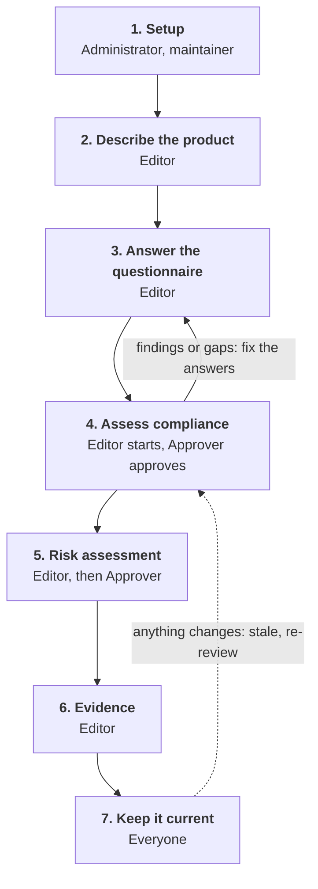
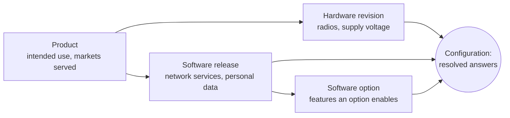
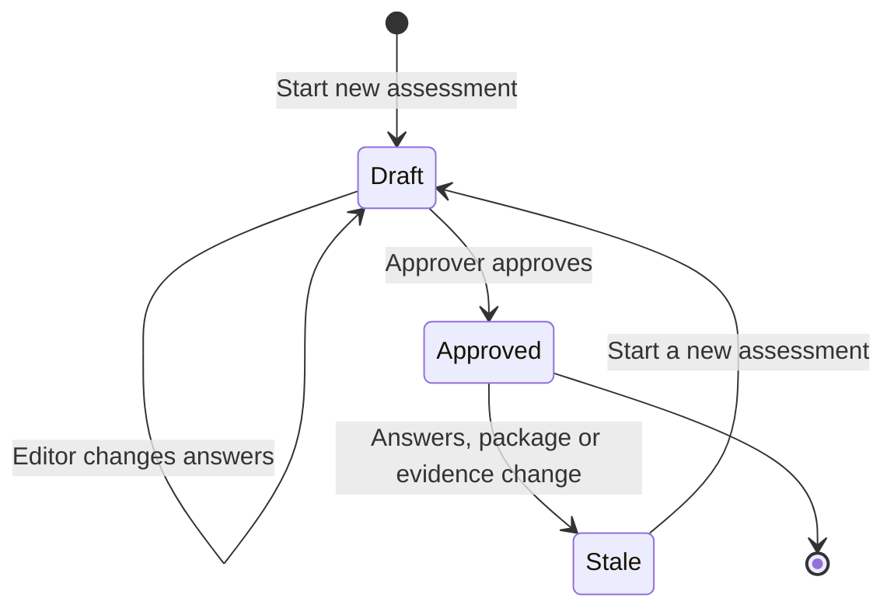
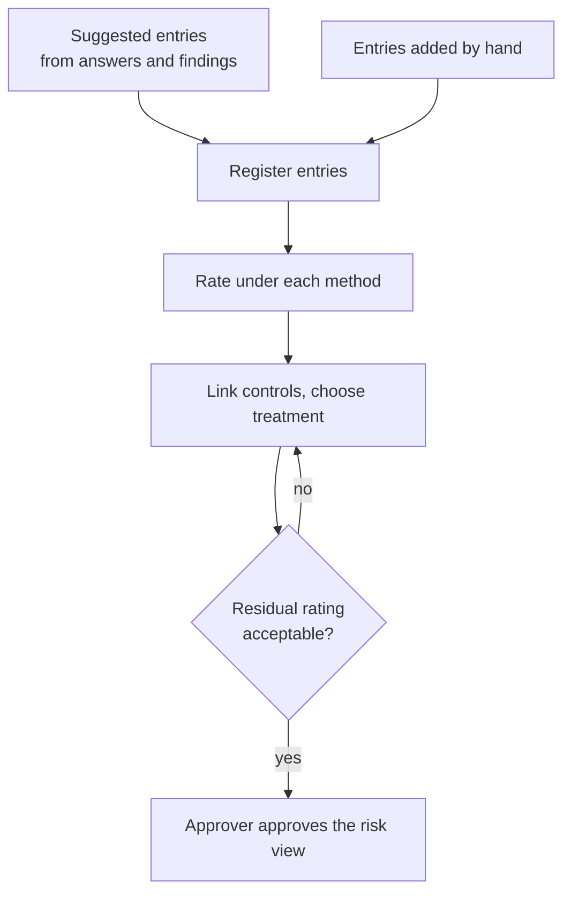

# Intended workflow

This page shows the order in which information is meant to be filled in,
who does each step, and where in Aavistin it happens. Each later step
builds on the earlier ones, so working top to bottom avoids re-entering
anything.

## The whole flow

## 1. Setup

Done once by an administrator or maintainer.

- Create the **organisation** and **product family** the product belongs
  to, then grant **roles** (see [getting started](getting-started)).
  Remember the separation-of-duties policy: the person who edited the
  answers should not be the one who approves them.
- Requirement packages are authored data. A maintainer **imports** each
  package, checks the lint report, fixture results and diff, and then
  **approves** it. Only approved packages are used in assessments.

## 2. Describe the product

An **Editor** builds the structure under the product page, in this
order, because each level refers to the one before:

1. **Product** — from the product family on the Portfolio page.
2. **Hardware variant**, with its **target markets** (for example EU).
   Target markets decide which requirement packages are asked about, so
   set them before answering anything. Then add a **hardware revision**.
3. **Software release** and, if the software has optional feature
   packs, **software options**.
4. **Configuration** — one hardware revision, one software release and
   any options. This is the unit that is assessed.

See [organisations and products](organisations-and-products).

## 3. Answer once, at the right level

Every question belongs to one level, and you answer it **once** at that
level. More specific levels inherit the answer and only override it when
they genuinely differ.

- Questions that several regulations ask in different words are shared:
  you answer the question once and every package that uses it reads the
  same answer. Some answers are **derived** from others (for example
  "MFA for administrators" follows from "MFA for all users") and are
  labelled as such; an answer you enter yourself always wins.
- Overriding an inherited answer needs a **justification**.
- A new software release starts from the previous release's answers,
  marked **needs confirmation**. Confirm each one actively; reviewers
  may confirm in bulk but never silently.
- Fill in the questionnaire from the configuration page. The
  assessment page lists every answer with a link back to its question.

See [requirement packages and assessments](requirement-packages-and-assessments).

## 4. Assess compliance

1. An **Editor** starts an assessment from the configuration page.
2. Read the results: which packages are in scope, the classification,
   the requirements, the allowed assessment routes and the **findings**.
3. Where a finding or an unexpected result points at a wrong or missing
   answer, go back to the questionnaire, fix it and look again.
4. An **Approver** approves. This freezes a snapshot of the answers,
   results and findings. Later changes never rewrite it; they only mark
   it **stale**.

## 5. Risk assessment

The risk register belongs to the product and is viewed per
configuration (baseline entries plus the deltas that apply).

1. Start from the **suggested** entries triggered by your answers and
   findings; accept them or dismiss them with a reason. Add anything
   else by hand.
2. Enter **assets** first, then the **threats** against them and the
   **hazards** they can cause. Scope an entry to one hardware variant,
   software release or option only when the risk really differs there,
   and justify it.
3. Rate each threat and hazard under every applicable method.
4. Add **controls** and decide the **treatment**. The residual rating
   is checked against the method's acceptance thresholds.
5. An **Approver** approves the view; it goes stale in the same way as
   an assessment.

> **Current state of the app:** the risk register is shown in the app
> (register and entry pages, linked from the product and configuration
> pages), but entries, ratings and treatments are still created in the
> Django admin. Editing screens, suggestions and approval in the app
> follow. See [risk assessment](risk-assessment).

## 6. Evidence

Attach evidence (a file, a link or a text reference) to the requirement
or control it supports, from the product's **Evidence** page. Expired or
superseded evidence makes the approvals that rely on it stale. See
[evidence](evidence).

## 7. Keeping it current

| What changed | What happens | What you do |
| --- | --- | --- |
| An answer | Approved assessments become stale | Review and approve a new assessment |
| A requirement package version | Approved assessments become stale | Review the diff, approve again |
| Evidence expired or replaced | Approvals relying on it become stale | Relink or renew the evidence |
| New software release | Answers are copied from the previous release as "needs confirmation" | Confirm or correct each one |
| A new target market | New questions appear unanswered | Answer them, then assess again |

## Where each piece of information goes

| Information | Level | Where | Who |
| --- | --- | --- | --- |
| Organisation, families, roles | Organisation / family | Administration | Administrator |
| Requirement packages | Global | Import and approve | Maintainer |
| Product name and description | Product | Product page | Editor |
| Target markets | Hardware variant | Product page, Hardware variants tab | Editor |
| Intended use, markets served | Product | Configuration page, questionnaire | Editor |
| Radios, power supply | Hardware revision | Configuration page, questionnaire | Editor |
| Network services, personal data | Software release | Configuration page, questionnaire | Editor |
| Optional feature differences | Software option | Configuration page, questionnaire | Editor |
| Assets, threats, hazards, controls | Product (scoped when needed) | Risk register | Editor |
| Evidence | Requirement or control | Product's Evidence page | Editor |
| Approval | Assessment / risk view | Assessment page | Approver |
